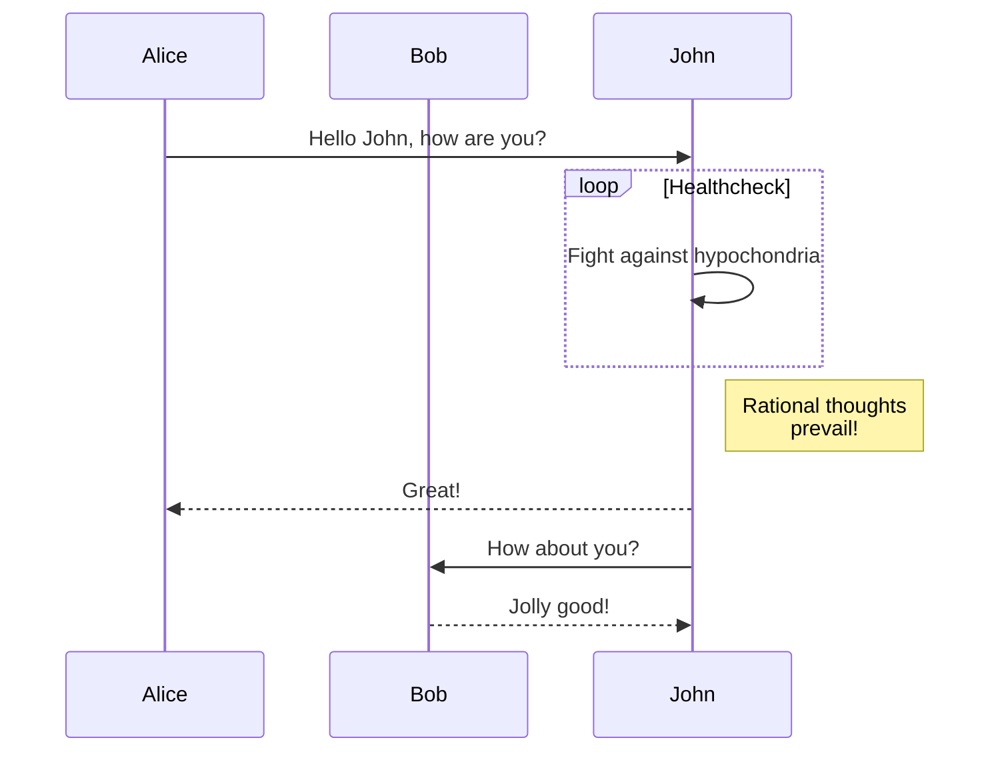

# Mermaid Demo

This is a simple playground for experimenting with [Mermaid][1], "a Javascript based diagramming and charting tool that uses Markdown-inspired text definitions and a renderer to create and modify complex diagrams." To use it:

1. Run `yarn install`
2. Make sure you have `fswatch` and `pandoc` installed
3. Run `bin/serve`
4. Open <http://localhost:8000> in your browser
5. Edit the diagram below, then refresh your browser to see your changes reflected

## Example Sequence Diagram

[1]: https://mermaid-js.github.io/mermaid/#/
